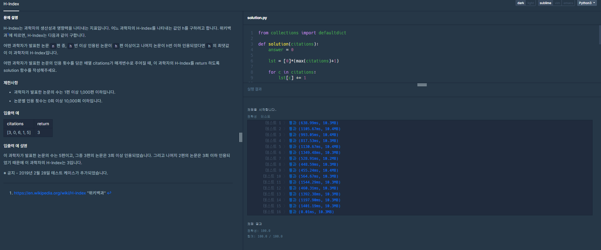

[프로그래머스 : h-index] (https://programmers.co.kr/learn/courses/30/lessons/42747#)


- 생각보다 너무 애먹은 문제...... 
- 막상 풀고나니 로직은 정말 간단했다.
- 중간에 안풀려서 defaultdict에 별에별 뻘짓은 다했다....
- 로직
  - lst라는 배열을 만든다. 배열의 인덱스는 논문의 인용건수, 배열의 값은 해당 인용건수를 가지는 논문의 수
  - 자기 자신의 인덱스 값보다 자신을 포함한 오른쪽에 있는 값들의 합이 클 경우 자신의 인덱스 수보다 많이 논문이 인용되었음을 의미함. 그 후 나머지 논문이 h번 이하 인용되었음을 조사해준다.


```python
from collections import defaultdict # 쓰지않음..... 심지어 정렬도 딱히 활용 안하고 맞춤

def solution(citations):
    answer = 0
    
    lst = [0]*(max(citations)+1)
    
    for c in citations:
        lst[c] += 1
        
    print(lst)
        
    ll = len(lst)
    for ls in range(ll):
        if ls <= sum(lst[ls:]):
            if ls >0:
                s = True
                for k in range(ls):
                    if sum(lst[:k]) <= ls:
                        pass
                    else:
                        s = False
                if s == True:
                    answer = ls
                
                
        
        
    return answer
```

