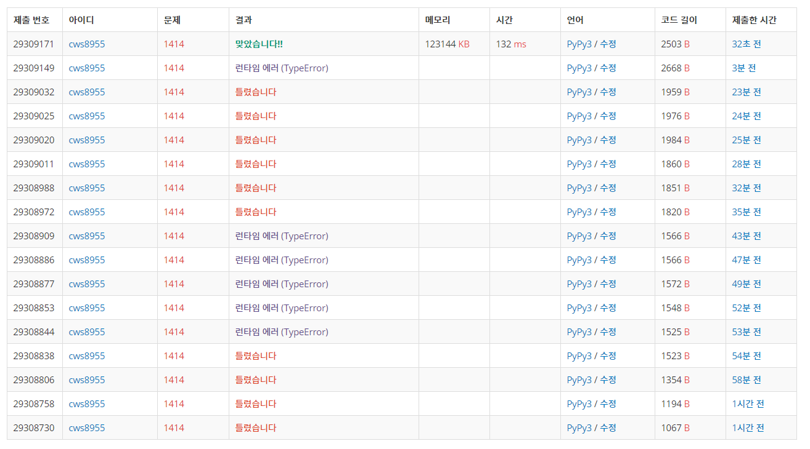

[백준 : 불우이웃돕기] (https://www.acmicpc.net/problem/1414)


- 엄청난 고생 끝에 겨우 푼 문제

- 최소스패닝 트리를 활용한 문제이다.
- 엄청나게 많이 틀렸는데 틀린 이유는 이 문제의 경우 양방향 간선 그래프인데 상행과 하행의 숫자가 다르다. 나는 이를 잘 해결하지 못했었다. 2시간 가량의 사투끝에 겨우 성공했다.
- 또한 처음에 어느 정점에서 시작할지를 찾는 과정도 힘들었다.


```python
import sys
sys.stdin = open('1414.txt','r')
import heapq

def min_tree():
    global n,arr,start

    if start == None:
        start = 0

    answer = [float('inf')]*n
    mst = [0]*n
    answer[start] = 0
    pq = []
    heapq.heappush(pq,[answer[start],start])
    result = 0

    while pq:
        now_distance ,now_position = heapq.heappop(pq)

        if mst[now_position] != 0:
            continue

        mst[now_position] = 1
        result += now_distance

        for k in range(n):
            if now_position != k:
                nxt = k
                st = None
                wt = None
                if arr[now_position][k] != 'q':
                    wt = arr[now_position][k]
                if arr[k][now_position] != 'q':
                    st = arr[k][now_position]

                if st != None and wt != None:
                    kt = min(st,wt)
                    if mst[k] == 0 and answer[nxt] > kt:
                        answer[nxt] = kt
                        heapq.heappush(pq,[kt,nxt])
                elif st == None and wt != None:
                    if mst[k] == 0 and answer[nxt] > wt:
                        answer[nxt] = wt
                        heapq.heappush(pq,[wt,nxt])
                elif st != None and wt == None:
                    if mst[k] == 0 and answer[nxt] > st:
                        answer[nxt] = st
                        heapq.heappush(pq,[st,nxt])
    for k in range(n):
        if answer[k] == float('inf'):
            return -1

    return result

n = int(input())
arr = []
for _ in range(n):
    arr1 = list(input())
    arr.append(arr1)

total = 0
for y in range(n):
    for x in range(n):
        if arr[y][x] != '0':
            confirm = arr[y][x].isupper()
            if confirm == False:
                arr[y][x] = ord(arr[y][x]) - 96
                total += arr[y][x]
            else:
                arr[y][x] = ord(arr[y][x]) - 38
                total += arr[y][x]
        else:
            arr[y][x] = 'q'

start = None
start_point = 100000000
for y in range(n):
    for x in range(n):
        if arr[y][x] != 'q':
            if y != x:
                if start_point > arr[y][x]:
                    start_point = arr[y][x]
                    start = y

results = min_tree()
if results == -1:
    print(-1)
else:
    print(total-results)
```

