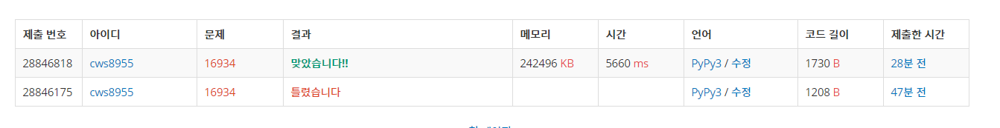

[백준 : 게임 닉네임] (https://www.acmicpc.net/problem/16934)


- 트라이 구조에 대한 기본 수도코드를 인터넷을 통해 보고 익힌 후 트라이구조를 활용한 게임 닉네임 문제를 풀어보았다. 아직은 많이 미숙한 것 같다. 더 열심히 해야겠다.


```python
import sys
sys.stdin = open('16934.txt','r')

n = int(input())

class Node(object):
    def __init__(self,key,data=None,number=0):
        self.key = key
        self.data = data
        self.children = {}
        self.number = number

class Trie(object):
    def __init__(self):
        self.head = Node(None)

    def insert(self,string):
        curr_node = self.head
        strr = ''
        flag = False
        for char in string:
            strr += char
            if char not in curr_node.children:
                curr_node.children[char] = Node(char)
                if flag == False:
                    print(strr)
                flag = True
                # curr_node.children[char].number += 1

            curr_node = curr_node.children[char]

        curr_node.data = string
        curr_node.number +=1
        # print(string,curr_node.number)
        if flag == False:
            # if curr_node.number == 0:
            #     curr_node.number += 1
            #     print(strr)
                # strr += str(curr_node.number)
                # print(strr)
                # curr_node.number += 1
                # print(curr_node.number)
            # else:
            # curr_node.number += 1
            if curr_node.number == 1:
                print(strr)
            else:
                strr += str(curr_node.number)
                print(strr)

            

        return

    def search(self,string):
        curr_node = self.head

        for char in string:
            if char not in curr_node.children:
                return False
            else:
                curr_node = curr_node.children[char]

        if curr_node.data != None:
            return True

t = Trie()
for _ in range(n):
    stringg = input()
    t.insert(stringg)


```



