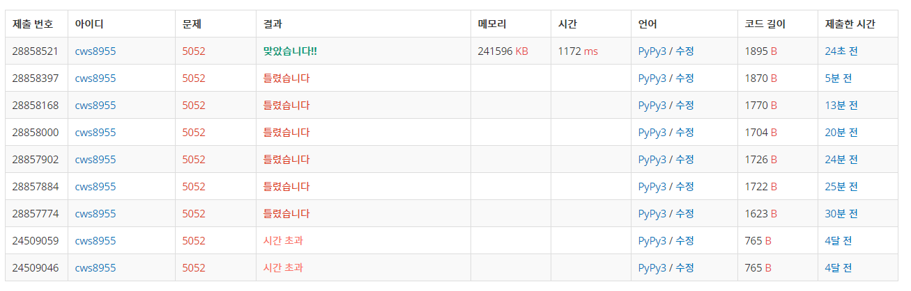

[백준 : 전화번호 목록] (https://www.acmicpc.net/problem/5052)


-  정렬을 통해 트라이로 구현하는 문제
- 01과 1을 그냥 int로 변환시키면 같다는 사항에서 틀렸습니다가 나왔었음.
- 이를 해결하기 위해 brr에 소팅을 위해 변환한 숫자와 문자열 기존값 두개를 넣음


```python
import sys
sys.stdin = open('5052.txt','r')

class Node(object):
    def __init__(self,key,data=None):
        self.key = key
        self.data = data
        self.child = {}

class Trie(object):
    def __init__(self):
        self.head = Node(None)


    def insert(self,string):
        curr_node = self.head

        nxt = 1
        for char in string:
            if char not in curr_node.child:
                curr_node.child[char] = Node(char)
                
            if curr_node.child[char].data != None and nxt == len(string):
                # print(string,nxt,curr_node.child[char].data)
                return False
            else:
                curr_node.child[char].data = string
            curr_node = curr_node.child[char]
            nxt += 1

        curr_node.data = string
        return True
        # if curr_node.data == None:
        #     curr_node.data = string
        # else:
        #     print('----',curr_node.data)

    def search(self,string):
        curr_node = self.head

        for char in string:
            if char in curr_node.child:
                curr_node = curr_node.child[char]
            else:
                return False
        
        if curr_node.data != None:
            return True

t = int(input())
for tc in range(t):
    trie = Trie()
    n = int(input())
    brr = []
    for _ in range(n):
        brr1 = input()
        # print(brr1)
        brr2 = brr1.replace(" ","")
        # print(brr2)
        brr1 = int(brr2)
        brr.append([brr1,brr2])
    brr.sort(key=lambda x:x[0])
    brr.reverse()
    arr = []
    for br in brr:
        b = str(br[1])
        arr.append(b)
    # print(arr)

    # arr.sort(key=lambda x:len(x))
    # arr.reverse()
    # print(arr)
    flag = False
    for ar in arr:
        ss= trie.insert(ar)
        if ss == False:
            flag = True
            print('NO')
            break
    if flag == False:
        print('YES')
    # flag = False
    # for ar in arr:
    #     s = trie.search(ar)
    #     if s == False:
    #         flag = True
    #         print('No')
    #         break
    # if flag == False:
    #     print('Yes')
```

